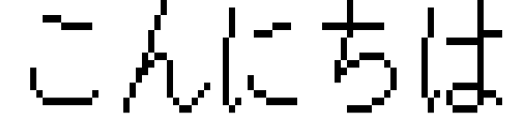

# dotboard（仮）

テキスト・画像・動画を、日本の駅の発車標（電光掲示板）風のドット表示に変換するツールです。

> **現在開発中です。** 入出力はテキスト入力 → ターミナルへのテキスト出力のみ対応しています（画像・動画の入出力は未実装です）。

設計の詳細は [docs/DESIGN.md](docs/DESIGN.md) を参照してください。

## 動作確認環境

現在 **Linux** でのみ動作確認をしています（macOSなど他のOSでは未確認です）。

## フォントについて

文字の描画には [東雲フォント](http://openlab.ring.gr.jp/efont/) を利用しています。Yasuyuki Furukawa氏による原作（Public Domain）を、/efont/ プロジェクトが改変・保守しているものです。フォントファイルは `fonts/` 以下に同梱しています。

## 対応している文字

半角英数字と、日本語の標準的な文字（漢字・ひらがな・カタカナなど）のみ表示できます。それ以外の記号や文字は表示できません。

## ビルド方法

プロジェクトのトップディレクトリで `make` を実行するだけです。

```sh
make
```

## 使い方

ビルド後、`build/bin/app` に実行ファイルが生成されます。表示したい文字列を引数として渡してください。

```sh
./build/bin/app "こんにちは"
```

出力例:


